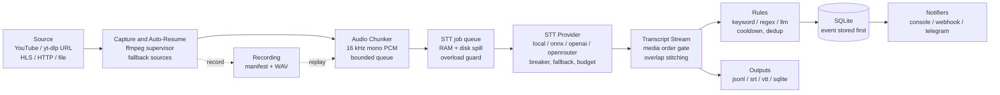

# livestream-transcriber

Real-time transcription of live streams with pluggable local or cloud speech-to-text, event rules and notifiers, built to keep running when the stream, the network or the provider does not.

[](https://github.com/TrainABit/Automatic-Live-Stream-Transcription/actions/workflows/ci.yml)
[](LICENSE)
[](pyproject.toml)

## Demo

A text-to-speech clip, transcribed by the local `base` Whisper model (no API key, no network
after the model download), with the example rules from this repository. This is the real,
unedited console output (stdout); of the log lines that go to stderr only the final summary is
shown.

```console
$ say -v Samantha -o demo.aiff "Welcome to the stream. Today we talk about the new release. ..."
$ lst run --url demo.wav --stt local --model base --language en --rules rules.example.yaml
[0:00:00] Welcome to the stream, today we talk about the new release, there is also a giveaway tonight.
ALERT [INFO] new-release
  A launch or release announcement
  Matched: new release
  Text: Welcome to the stream, today we talk about the new release, there is also a giveaway tonight.
  At 0:00:00 in demo.wav
ALERT [WARNING] giveaway
  A giveaway or free copy is mentioned
  Matched: giveaway
  Text: Welcome to the stream, today we talk about the new release, there is also a giveaway tonight.
  At 0:00:00 in demo.wav
[0:00:05] so stay tuned, our security update is out now and it fixes of vulnerability.
ALERT [INFO] security-mention
  Security topics come up
  Matched: security update
  Text: new release, there is also a giveaway tonight. so stay tuned, our security update is out now and it fixes of vulnerability.
  At 0:00:05 in demo.wav
ALERT [INFO] new-release
  A launch or release announcement
  Matched: out now
  Text: new release, there is also a giveaway tonight. so stay tuned, our security update is out now and it fixes of vulnerability.
  At 0:00:05 in demo.wav
ALERT [INFO] security-mention
  Security topics come up
  Matched: vulnerability
  Text: new release, there is also a giveaway tonight. so stay tuned, our security update is out now and it fixes of vulnerability.
  At 0:00:05 in demo.wav
15:48:10.939 INFO    pipeline.session       session summary  chunks=3 audio_s=10.4 utterances=2 rule_hits=5 dropped=0 gaps=0
```

The transcription error in the second line ("fixes of") is the model's and was left in. The run
also wrote `out/transcript.jsonl`, `out/transcript.srt`, `out/transcript.vtt` and `out/lst.db`.

## Features

- **Sources:** YouTube and any other URL yt-dlp understands, direct HLS (`.m3u8`) and HTTP media
  URLs (these bypass yt-dlp), and local files. A run can name ordered fallback sources
  (`--fallback`), for example a simulcast or a mirror.
- **Audio only:** ffmpeg decodes to 16 kHz mono PCM; there is no video decoding, OCR or frame
  handling anywhere in the pipeline.
- **Speech-to-text providers:** local [faster-whisper](https://github.com/SYSTRAN/faster-whisper)
  (default), local [sherpa-onnx](https://github.com/k2-fsa/sherpa-onnx) (Parakeet, Moonshine),
  OpenAI and any OpenAI-compatible server, and OpenRouter. `mock` and `none` exist for tests and
  dry runs. A missing extra or API key is a startup error, not silence.
- **Resilience:** reconnect supervisor with full-jitter exponential back-off, audio stall
  watchdog, auto-resume that waits for an offline stream to come back, per-provider circuit
  breaker, cloud-to-local fallback and a spend budget (`LST_STT_BUDGET_USD`).
- **Backpressure:** bounded queues with explicit overflow policies, disk spill for STT jobs, and
  an overload guard that pauses transcription and probes for recovery.
- **Event rules (YAML):** keyword (whole word, phrase), regex with named groups, and optional
  LLM rules against any OpenAI-compatible chat endpoint. Cooldown, fuzzy de-duplication,
  severity escalation and shared groups, all on stream time. `lst rules test` dry-runs a rule
  file against a sentence.
- **Notifiers:** console, generic webhook (`json`, `slack` or `discord` payload) and Telegram,
  with per-target retry and a rate limiter.
- **Outputs:** JSONL, SRT, WebVTT and SQLite (sessions, segments, transcripts, events, deliveries).
- **Record and replay:** capture audio once, then re-run it through any provider and rule set,
  deterministically.
- **Benchmarking:** `lst bench` reports WER, CER, latency percentiles, real-time factor and cold
  start per provider on your own clips.
- **Operations:** `lst doctor`, an `LST_HEARTBEAT` liveness line, secret redaction on every log
  handler, an optional memory limit, exit codes a supervisor can act on, Docker and systemd
  examples.
- **Quality gates:** about 1,200 offline tests (network access is blocked by a fixture), `ruff`,
  and strict `mypy` typing on `src`.

## Quick start

### Local, no API key

Requires Python 3.11+, [ffmpeg](https://ffmpeg.org/) on the `PATH`, and, for YouTube URLs, a
JavaScript runtime such as [deno](https://deno.com/) that yt-dlp uses. `lst doctor` checks all of it.

```bash
# with uv
uv tool install "livestream-transcriber[local] @ git+https://github.com/TrainABit/Automatic-Live-Stream-Transcription.git"

# or with pip
pip install "livestream-transcriber[local] @ git+https://github.com/TrainABit/Automatic-Live-Stream-Transcription.git"

lst doctor                                   # verify ffmpeg, yt-dlp, the model runtime, ...
lst run --url https://example.com/live.m3u8  # console transcript + files in out/
```

The first run downloads the Whisper model (`small` by default) from Hugging Face. Useful
variations:

```bash
lst run --url talk.mp4 --stt local --model base --language en    # a local file
lst run --url URL --rules rules.example.yaml                     # with alerts
lst run --url URL --fallback URL2 --record recordings/talk       # backup source, keep the audio
lst record talk --url URL --duration 300                         # capture only ...
lst replay recordings/talk --stt mock --rules rules.yaml         # ... then re-run offline
lst bench --clips clips --stt local:tiny,local:base,local:small  # accuracy and speed
lst rules test rules.example.yaml "there is a giveaway tonight"  # dry-run the rules
```

For cloud providers set `LST_STT_PROVIDER=openai` (or `openrouter`) and the matching key; see
[Configuration](#configuration). Local models are CPU-bound. The default is four threads, which
keeps `small` faster than real time on a recent laptop; on a weaker machine pick a smaller
model (see [docs/benchmarks.md](docs/benchmarks.md)).

### Docker

```bash
cp .env.example .env
cp rules.example.yaml rules.yaml
STREAM_URL=https://example.com/live.m3u8 docker compose up --build
```

The image is `python:3.12-slim` plus ffmpeg, runs as the non-root user `lst` and has
`ENTRYPOINT ["lst"]`, so after `docker build -t livestream-transcriber .` a command such as
`docker run --rm livestream-transcriber doctor` works too. Output goes to `./out`, recordings
to `./recordings` and models to a named volume. The image does not include a JavaScript
runtime, so YouTube page URLs may need one added; direct HLS and HTTP media URLs do not. A
systemd unit is in [`deploy/systemd/lst.service`](deploy/systemd/lst.service).

## Architecture



Capture and STT are decoupled on purpose: capture must never wait for a network call, so the
only handoff is a queue with a written overflow policy. A recording feeds the same chunk
interface as a live source, which is what makes replay a faithful test harness. Module map:
`stream/` (sources, ffmpeg, resume, fallback, record and replay), `audio/` (ordering gate, job
queue, speech stream), `stt/` (providers and wrappers), `pipeline/` (engine, overload guard,
session loop), `rules/`, `notify/`, `outputs/`, `store/` and `bench/`. More detail in
[docs/architecture.md](docs/architecture.md).

## STT providers

A qualitative comparison. Numbers for local models are measured in
[docs/benchmarks.md](docs/benchmarks.md); the cloud figures there come from an earlier benchmark
of six cloud models on German live-stream speech and are field notes, not a ranking.

| Provider (`--stt`) | Latency per chunk | Cost | Quality | Privacy |
|---|---|---|---|---|
| `local` (faster-whisper) | Depends on CPU and model size: about 0.1x to 0.6x real time on four laptop threads, `tiny` to `small` | Free | Good to very good, grows with model size; may invent text on silence or music | Audio never leaves the machine |
| `onnx` (sherpa-onnx: Parakeet TDT 0.6B v3 by default, Moonshine base English) | Meant for fast CPU inference; not benchmarked here | Free | Not benchmarked here | Audio never leaves the machine; models are fetched explicitly with `lst models fetch` |
| `openai` (`whisper-1`, `gpt-4o-mini-transcribe`, or any OpenAI-compatible server) | Network round trip: seconds per 5 s chunk, with occasional long tails | Paid per audio minute (free if `LST_OPENAI_BASE_URL` points at your own server) | Very good | Audio is sent to the provider, or to your own server |
| `openrouter` (Whisper variants and other transcription models) | Network round trip; varies strongly by model and by hour of the day | Paid per audio minute, one key for many models | Depends on the model; see the hallucination notes in the benchmarks | Audio goes to OpenRouter and to the upstream model provider |

## Configuration

Settings come from the environment or a `.env` file (`--env-file FILE`, default `./.env`), with
the prefix `LST_`. Precedence: command line flags, process environment, `.env`, defaults. The
two API keys also accept the vendors' usual names (`OPENAI_API_KEY`, `OPENROUTER_API_KEY`).
The complete reference, generated from `config.py`, is
[docs/configuration.md](docs/configuration.md); a commented template is
[`.env.example`](.env.example). The essentials:

| Variable | Default | Purpose |
|---|---|---|
| `LST_STT_PROVIDER` | `local` | `local`, `onnx`, `openai`, `openrouter`, `mock` or `none` |
| `LST_STT_MODEL` | provider default | `small` (local), `whisper-1` (openai), `openai/whisper-large-v3` (openrouter) |
| `LST_STT_LANGUAGE` | auto-detect | ISO code such as `en` or `de` |
| `LST_STT_FALLBACK` | `none` | Provider to use when the primary keeps failing, typically `local` |
| `LST_STT_THREADS` | `4` | CPU threads for local inference |
| `LST_STT_WORKERS` | `1` | Concurrent transcription requests |
| `LST_STT_BUDGET_USD` | unset | Stop using a cloud provider once its estimated spend reaches this |
| `LST_STT_MAX_LAG_SECONDS` | `45.0` | Overload guard: pause STT when it falls this far behind (0 disables) |
| `LST_OPENAI_API_KEY` | unset | Key for `openai` (secret) |
| `LST_OPENAI_BASE_URL` | `https://api.openai.com/v1` | Any OpenAI-compatible server |
| `LST_OPENROUTER_API_KEY` | unset | Key for `openrouter` (secret) |
| `LST_CAPTURE_LIVE_CHUNK_SECONDS` | `2.5` | Chunk length for live sources |
| `LST_CAPTURE_AUDIO_STALL_SECONDS` | `30.0` | Restart capture when no audio arrives for this long |
| `LST_CAPTURE_COOKIES_FILE` | unset | Netscape cookie file for yt-dlp |
| `LST_RESUME_AUTO` | `true` | Keep probing after the stream ends and resume when it returns |
| `LST_NOTIFY_WEBHOOK_URL` | unset | Webhook target (secret) |
| `LST_NOTIFY_WEBHOOK_FORMAT` | `json` | `json`, `slack` or `discord` |
| `LST_NOTIFY_TELEGRAM_TOKEN`, `LST_NOTIFY_TELEGRAM_CHAT_ID` | unset | Telegram bot (token is a secret) |
| `LST_RULES_FILE` | unset | Rules file when `--rules` is not given |
| `LST_OUT_DIR`, `LST_DB_PATH` | `out`, `<out>/lst.db` | Where transcripts and the database go |
| `LST_HEARTBEAT_SECONDS` | `60.0` | Interval of the `LST_HEARTBEAT` liveness line (0 disables) |
| `LST_LOG_LEVEL` | `INFO` | Same as `--log-level` |

### Rules

Rules live in a YAML file; the complete annotated example is
[`rules.example.yaml`](rules.example.yaml):

```yaml
version: 1

defaults:
  cooldown_seconds: 60      # the same match stays quiet for this long (stream time)
  notify: [console]

rules:
  - id: giveaway
    description: A giveaway or free copy is mentioned
    type: keyword
    keywords: [giveaway, "free copy", gewinnspiel]
    severity: warning
    cooldown_seconds: 300
    notify: [console, webhook]

  # Rules that share a `group` share cooldown state: a critical hit for the same
  # phrase is delivered even while the info alert is still cooling down.
  - id: security-incident
    type: keyword
    keywords: [breach, "data leak", "security incident"]
    severity: critical
    group: incidents
    notify: [console, webhook, telegram]

  - id: version-number
    type: regex
    pattern: '\bv(?P<major>\d+)\.(?P<minor>\d+)(?:\.(?P<patch>\d+))?\b'
    severity: info
```

Keywords match whole words, and punctuation between the words of a phrase is ignored
(providers punctuate differently). A symbol inside a keyword, as in `C++`, is matched
literally; speech models often write it out ("C plus plus"), so list that spelling as well.

`lst rules test rules.yaml "some text"` shows which rules a sentence would trigger. A target
that a rule names but that is not configured (for example `telegram` without a token) is logged
once and skipped.

### Exit codes

| Code | Meaning |
|---:|---|
| 0 | Finished normally |
| 1 | A command failed at run time (a model download failed) |
| 2 | Configuration error (invalid setting, missing key or extra, unreadable rules, a benchmark where no provider can start) |
| 3 | The source is not live |
| 4 | No data arrived |
| 5 | The stream was lost |
| 130 | Stopped by a signal; outputs are finalised |

## Design decisions

**Backpressure is a decision, not an accident.** A live pipeline that buffers without limit is
an OOM kill on a small machine, so every queue has a size and an overflow policy. Live capture
uses `DropOldestQueue`: when the consumer falls behind, the stalest chunk is discarded (a stale
chunk is worth little once a newer one exists), the drop is counted, and ffmpeg is never
stalled. The STT job queue keeps a few chunks of PCM in RAM and spills the next 240 to
temporary files, so a slow provider does not silently discard speech and a small machine is
not asked to hold an hour of audio. Files and replay use a lossless `put_wait` instead,
because the same recording must not lose a chunk because the machine was busy. An overload
guard watches lag and drop ratio over a sliding window; when either says the lane cannot keep
up it pauses transcription, sends only occasional recovery probes, and doubles the probe
interval after a relapse, so a half-working provider costs one pause/resume pair per growing
interval instead of one per minute. The guard is free of asyncio and takes an injectable
clock, so every branch is tested without sleeping.

**Results are put back into media order.** Concurrent STT requests come back whenever the
provider answers, and a retry or a slow shard is enough to swap two chunks. `MediaOrderGate` is
a reorder buffer on the session clock: chunks are announced in media order before the request
is made and released strictly in that order, never while an earlier one is still outstanding.
Its `frontier` is the honest answer to "how far has transcription actually got": the end of
the longest contiguous run of finished chunks. Downstream of it, `SpeechStream` stitches
overlapping or repeated text (a sentence cut in two by a chunk boundary, or repeated by a
rolling window), so an utterance is emitted once or replaces the previous one as a revision.
Its memory is bounded by a fixed history however long the stream runs.

**Reconnects and outages are expected.** A supervisor restarts ffmpeg after a full-jitter
exponential delay, so an outage on the platform side does not turn into a synchronised
reconnect storm. An audio stall watchdog (audio only, no frame checks) restarts a capture that
still has a process but no data, and a frozen HLS playlist is held and re-checked instead of
being hammered. `wait_until_live` and `ProbeBackoff` handle streams that are not online yet: a
plain "offline" is a conclusive answer and is probed at a normal cadence, while a bot check or
a probe error hides the answer and is backed off exponentially. Availability alerts are
edge-triggered, once per real change. Candidate sources are probed concurrently, the first live
one in the operator's order wins, and a running capture can fail over. Cloud providers sit
behind a circuit breaker, a fallback wrapper moves to the local model when it opens, and the
budget guard meters only paid calls.

**Secrets stay out of everything that is written.** A resolved media URL from a video platform
carries a playback signature, an expiry and the public IP of the capturing machine in its query
string. `redact.py` is the single source of truth: a `RedactingFilter` is attached to every log
handler; `redact_url` and `describe_command` scrub URLs and subprocess argument vectors, also in
recording manifests; bearer tokens, API keys and bot tokens are matched by shape; ffmpeg gets an
allowlisted child environment instead of a copy of yours; secret settings are `SecretStr`; and
`lst doctor --show-config` prints `set` or `unset` for them. Configuration errors name the
variable, never the value.

**Persist first, then notify.** An event row is committed to SQLite (autocommit, WAL) before any
notifier is called. Every successful delivery is recorded per target, `notified_at` is set only
when no target is left failing, and `pending_notifications()` returns the rest after a restart,
so a crash between "matched" and "sent" loses nothing and a retry repeats only the targets that
failed. A rate limiter (repeat guard plus token bucket) counts what it held back and reports it
on the next alert instead of dropping silently. The webhook `discord` format disables mentions,
so a transcript containing "@everyone" cannot ping a channel.

**Replay makes the pipeline testable.** The recorder writes `manifest.json`, `audio.jsonl` and
one WAV per capture segment, flushing and rewriting the manifest atomically, so a killed process
leaves a recording that replays up to its last flush. `ReplayStreamSource` implements the same
source interface as a live capture, and downstream code cannot tell them apart. `--speed 0` is
unthrottled and lossless, so the same recording gives the same transcript on any machine. Rule
cooldowns and de-duplication run on stream time rather than wall clock, so a replay produces
the same alerts as the live run did. The test suite leans on this: about 1,200 tests run
offline, with a fixture that blocks network access, synthetic audio generated with ffmpeg or
NumPy, and loopback servers standing in for webhooks and STT endpoints.

**Configuration fails loudly.** `Settings` is an immutable pydantic model. Choosing a cloud
provider without a key, an OpenRouter key against the OpenAI endpoint (which would answer 401),
an unknown provider name, a fallback equal to the primary, a missing `[local]` extra or an
unreadable rules file are all startup errors, and `lst doctor` reports the same problems ahead
of time. "No speech detected" is never allowed to mean "we could not listen": a provider result
of `None` is silence, while a transcript with status `unavailable` is a failure, and the two
are counted separately.

**Choices that trade something away.** Standard-library HTTP only (`netutil.py`) keeps the
dependency set small and makes network use easy to guard in tests, at the cost of hand-written
multipart and retry code. There is no language default: the model auto-detects unless
`--language` is set, and text normalisation (NFC plus case folding) is language neutral, with
German umlaut folding as an opt-in. Chunks are transcribed independently rather than streamed,
which sets a floor on latency (the chunk length) but works identically for every provider.

## Limitations

- **Audio only.** No OCR, no video frames, no on-screen text, no speaker diarisation and no
  translation. Transcripts carry no speaker labels.
- **Chunked, not streaming, recognition.** End-to-end latency is at least the chunk length plus
  inference time, and a word cut by a chunk boundary can be misheard (visible in the
  benchmark's error analysis).
- **Local speed is your CPU.** With the defaults (`small`, four threads) a recent laptop keeps
  up with real time; on one thread it does not (RTF 1.59). See
  [docs/benchmarks.md](docs/benchmarks.md), and lower the model size on a weak machine.
- **Speech models can invent text on silence or music.** Rules run on what the model says;
  review anything that acts on a transcript automatically.
- **YouTube is a moving target.** yt-dlp needs a current version and a JavaScript runtime, and
  platforms may bot-check a server. `lst doctor --url URL` shows what fails.
- **Tested on macOS and Linux.** Windows is untested. `LST_STT_DEVICE=cuda` is passed through to
  faster-whisper but has not been tested here. The systemd notifier (`READY=1`, watchdog
  pings) is active only when `NOTIFY_SOCKET` is set, that is under `Type=notify`; the shipped
  unit uses `Type=simple` and relies on the heartbeat line instead.
- **Not a hosted product.** There is no web UI, authentication or multi-tenant mode.

### Rights notice

Only process streams you have the rights to, or whose terms of service permit automated capture
and transcription. Broadcasters, platforms and participants may restrict recording,
transcription and redistribution, and speech is personal data in many jurisdictions. You are
responsible for how you use this software.

## Built with Claude Code

Built with Claude Code as a pair programmer: I owned architecture, review and testing.

Contributions are welcome: see [CONTRIBUTING.md](CONTRIBUTING.md) for setup and checks, and
[CHANGELOG.md](CHANGELOG.md) for release notes.

## License

[MIT](LICENSE)
